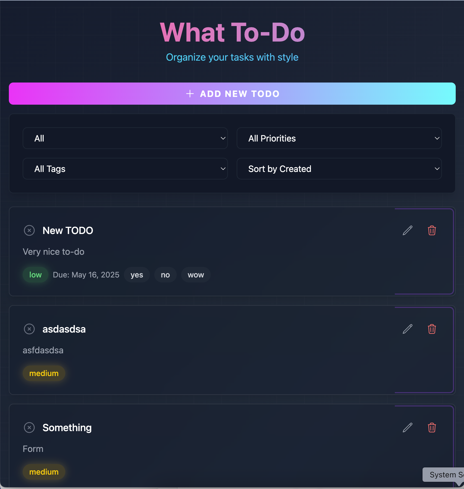

# What To-Do

A modern, feature-rich todo application built with React, Redux Toolkit, and Tailwind CSS. The app features a beautiful Vercel-inspired design with glass morphism effects and gradient accents.



## Features

- ✨ Modern, responsive UI with glass morphism effects
- 📱 Full mobile support
- 🎯 Task management with priorities (Low, Medium, High)
- 🏷️ Custom tags for better organization
- 📅 Due dates for tasks
- 🔍 Advanced filtering and sorting options
- 🎨 Beautiful gradients and animations
- 💾 Local storage persistence
- 🌓 Dark mode optimized

## Tech Stack

- **React** - UI Framework
- **Redux Toolkit** - State Management
- **TypeScript** - Type Safety
- **Tailwind CSS** - Styling
- **Vite** - Build Tool
- **Hero Icons** - Icons
- **date-fns** - Date Formatting

## Getting Started

### Prerequisites

- Node.js (v14 or higher)
- npm or yarn

### Installation

1. Clone the repository:

```bash
git clone https://github.com/yourusername/react-todo-advanced.git
cd react-todo-advanced
```

2. Install dependencies:

```bash
npm install
# or
yarn
```

3. Start the development server:

```bash
npm run dev
# or
yarn dev
```

4. Open [http://localhost:5173](http://localhost:5173) in your browser

## Project Structure

```
src/
├── components/          # React components
│   ├── AddTodo.tsx     # Add todo form
│   ├── Todo.tsx        # Todo item component
│   └── TodoList.tsx    # List of todos
├── store/              # Redux store
│   ├── index.ts        # Store configuration
│   └── todoSlice.ts    # Todo reducer and actions
├── hooks/              # Custom hooks
│   ├── useTodos.ts     # Todo management
│   ├── useFilters.ts   # Filtering logic
│   └── useTodoForm.ts  # Form handling
├── App.tsx            # Main app component
└── index.css         # Global styles
```

## Features in Detail

### Task Management

- Create, edit, and delete tasks
- Mark tasks as complete/incomplete
- Set priority levels (Low, Medium, High)
- Add custom tags
- Set due dates

### Filtering and Sorting

- Filter by status (All, Active, Completed)
- Filter by priority
- Filter by tags
- Sort by creation date, priority, or due date

### UI/UX Features

- Responsive design that works on all devices
- Glass morphism effects for modern look
- Smooth animations and transitions
- Gradient accents for visual hierarchy
- Intuitive task management interface

## Contributing

Contributions are welcome! Please feel free to submit a Pull Request.

## License

This project is licensed under the MIT License - see the [LICENSE](LICENSE) file for details.

## Acknowledgments

- Design inspired by Vercel's modern aesthetic
- Built with React and modern web technologies
- Icons provided by Heroicons
